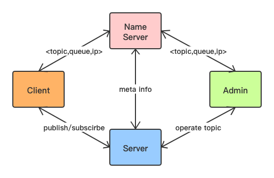

# TinyMQ 

## 整体架构

1. NameServer存储由Server端定时上报的元数据，提供给Client端和Admin端寻址服务。
2. Server端负责存储主题、队列和消息。
3. Client端从NameServer获取相应主题和队列对应的Server的ip地址，从而进行发布消息和订阅消息。
4. Admin端从NameServer获取相应主题和队列对应的Server的ip地址，进行topic的相关管理操作。

## 消息传输协议

## issue

1. 请求体和响应体的设计
2. 获取泛型的参数类型的折中方案
3. 粘包和半包问题netty解法
4. 客户端基于commons-pool池化管理channel