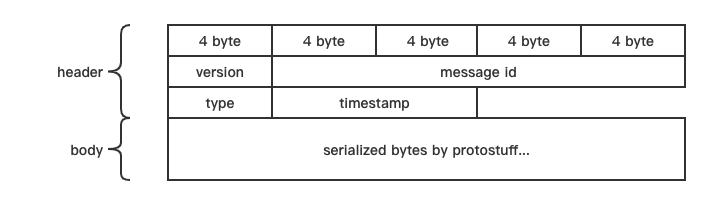
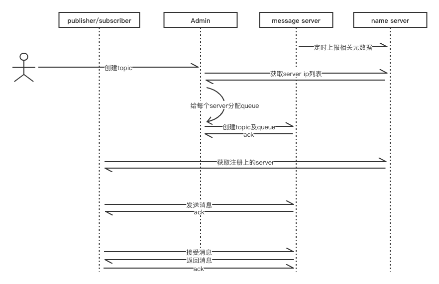

# TinyMQ 

## 整体架构

1. NameServer存储由Server端定时上报的元数据，提供给Client端和Admin端寻址服务。
2. Server端负责存储主题、队列和消息。
3. Client端从NameServer获取相应主题和队列对应的Server的ip地址，从而进行发布消息和订阅消息。
4. Admin端从NameServer获取相应主题和队列对应的Server的ip地址，进行topic的相关管理操作。

## 消息传输协议

消息传输协议简单设计，分为header和body，header包括4个字节的版本号version，16个字节的消息id，4个字节的消息类型，8个字节的当前时间戳；body为`protostuff`序列化后的字节数组。

## 主体流程

